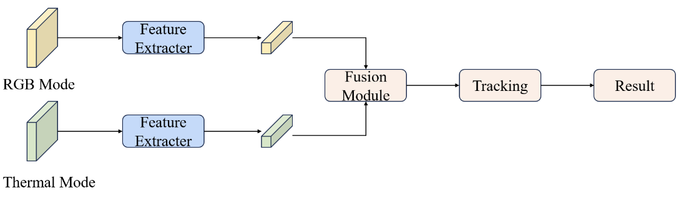
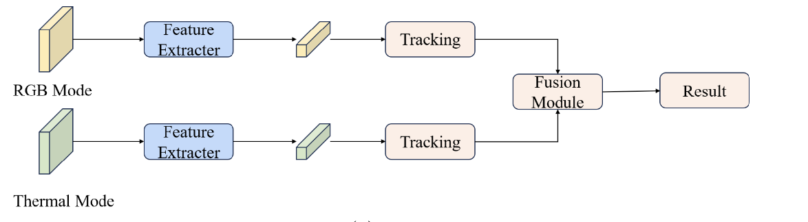
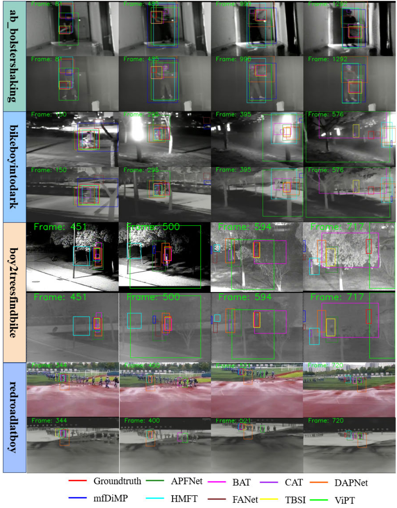

# 工作报告

[王倓](https://github.com/Mandorian)

<!--v-->

# A Comprehensive Review of RGBT Tracking

<!--v-->
## Overview
+ 对RGBT跟踪任务进行了全面总结，包括研究方法、测试基准、性能指标，以及不同跟踪方法对测试基准的实验分析
+ 对RGBT跟踪框架的四个模块进行了详细的分类和分析，指出了每个模块存在的问题以及目前的跟踪算法如何解决这些问题
+ 整理了公开的测试基准，并在这些基准上测试了一些有代表性的RGBT跟踪器
+ 探讨了RGBT跟踪任务的未来研究方向，并对该领域的发展趋势提出了建议

<!--s-->

# Feature Extraction Method

<!--v-->
## Handcraft Features-Based
传统的RGBT跟踪方法可以根据稀疏表示、热门排名、动态图、关联滤波进行大致分类。传统方法主要依靠手工制作的特征，如HOGs、[SIFT](https://lsxiang.github.io/Journey2SLAM/computer_vision/SIFT/)，结合卡尔曼滤波和粒子滤波等运动估计算法，来完成目标跟踪的任务。

<!--v-->
## Deep Feature-Based
基于深度学习的跟踪方法优于其他方法，比手动提取特征更有效和鲁棒，对于不同的模态，可以使用相同的CNN提取特征，也可以使用不同的CNN网络提取特征(DFNet、HATFNet)。\
在特征提取阶段，连续下采样限制了cnn的接受域，使得局部卷积核难以捕获全局特征表示。Transformer架构的核心概念是利用注意力机制，通过编码器和解码器的协同努力，将一个序列转换为另一个序列。该架构可以准确定位序列中的关键部分，突破传统CNN网络有限的接受野范围，从输入序列中获得全局信息(MACFT、BAT、TATrack)。

<!--s-->

# Fusion Strategy

<!--v-->
## Pixel Level
像素级融合是将RGB和热红外模式图像合并成复合图像，像素级融合策略旨在在RGB和TIR数据中存在的突出线索和低频信息之间取得平衡(MDLatLRR、mfDiMP)。\
像素级融合方法很直接，但它保留了源图像的大部分信息，同时引入了相当大的噪声，影响了跟踪器的性能。此外，处理时间较长，导致RGBT跟踪算法的速度明显降低。

<!--v-->
## Feature Level

特征级融合将提取的RGB和热红外特征按照预设规则进行融合，生成融合特征。CAT、ADRNet和APFNet侧重于解决特定模态的挑战。\
利用Transformer的编码器和解码器模块来获得目标的全局信息。随后，它使用互补的语义融合模块集成来自两种模式的信息，从而实现鲁棒跟踪(DFMTNet)。

<!--v-->
## Decision Level

首先分别对RGB模态图像和热红外模态图像进行跟踪，然后对跟踪结果进行合并，以获得最优的跟踪性能。\
与特征级融合相比，决策级融合通过考虑各种模式的决策结果进行加权融合，提供了更大的灵活性。决策级融合忽略了不同模态之间的相关性，导致信息丢失，计算复杂度高，在跟踪速度上没有优势。

<!--s-->
## Discriminant Module

在追踪任务中给定视频序列初始帧中的目标，跟踪器的目标是预测目标在后续视频帧中的位置。对于每次预测，跟踪器从新帧中提取候选样本，然后，使用判别模块来确定这些候选样本是否是目标。判别模型旨在从每个模态中提取判别信息，减少特征冗余和噪声，提升跟踪器的性能。

+ 传统框架
+ 深度学习框架
  + 基于特征选择(FusionNet、FTNet、DAPNet)
    + 但在选择过程中往往会删除有用的信息，导致跟踪性能下降。
  + 基于分类器预测(ATOM、DiMP)

<!--s-->
## Update Model

在跟踪过程中，视频序列中的目标和背景都在不断变化。因此，对目标和背景随时间的变化进行建模，并相应地更新RGBT跟踪模型，对跟踪算法至关重要。\
让跟踪器在时间序列中“不断自我调整”，保持对目标的最新表征，避免模型被旧信息“锁死”或被错误样本“污染”。

+ 外观自适应
  + 目标在跟踪过程中会因姿态、光照、遮挡、热分布变化等产生显著外观变化。更新模块通过增量学习或模板加权更新，使模型逐帧适应这些变化。
+ 模态权重更新
  + 在RGBT中，RGB和T模态的可靠性随场景变化而波动。更新模块会根据当前帧的响应置信度、相似度分布等，动态调整RGB与T的权重或融合策略。

<!--s-->
## Qualitative Analysis

+ 对于第一个序列，当对象的尺度发生变化以及在快速运动过程中，大多数跟踪器往往会经历跟踪漂移或跟踪失败。只有TBSI跟踪器才能接近目标的位置。
+ 对于第二个序列，在运动模糊和低光应用场景下，跟踪器的性能往往不能令人满意。在576帧中，由于视线不清，所有的跟踪器都没有正确识别目标，这表明运动模糊是RGBT跟踪发展的一个难题。
+ 对于第三个序列，跟踪器在OCC的情况下显示出局限性。在第451帧左右，大多数跟踪器可以识别目标，但在第594帧之后，由于树的遮挡，大多数跟踪器不能正确找到目标，TBSI跟踪器在OCC应用场景中表现出较强的鲁棒性。虽然BAT跟踪器可以跟踪目标，但与真实标签相比，预测结果并不准确。
+ 对于第四个序列，在类似目标干扰的情况下，跟踪器无法正确跟踪目标。在第400帧左右，一些跟踪器开始无法跟踪。在第720帧左右，摄像机突然移动导致跟踪器丢失目标，导致所有跟踪器跟踪错误

<!--v-->

<!--s-->
## Future Outlook

+ 构建大规模数据集
+ 开发多模态融合方法
+ 提出更高效率的跟踪方法
+ 设计轻量化的追踪模型
+ 开发针对特定挑战的跟踪器