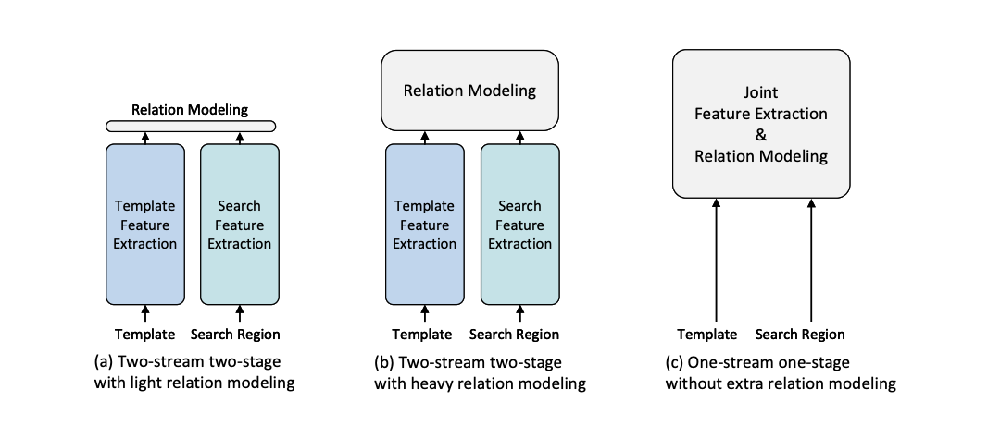
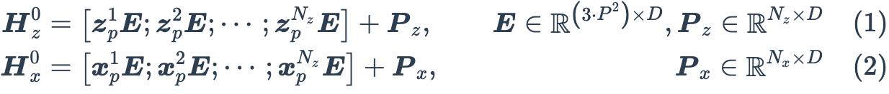
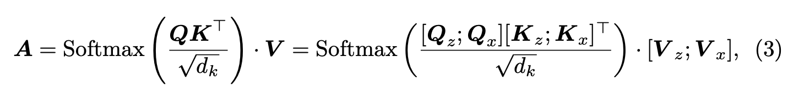
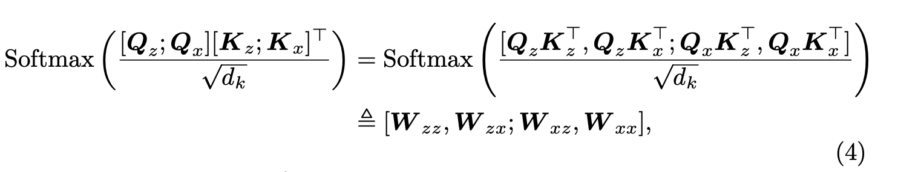

# 学习汇报

[王倓](https://github.com/Mandorian) 2025.12.19

<!--s-->

# Joint Feature Learning and Relation Modeling for Tracking: A One-Stream Framework

<!--v-->
## 动机
&emsp;&emsp;双流、双阶段跟踪框架分别提取模板和搜索区域特征，然后进行关系建模，因此提取的特征缺乏对目标的感知，目标-背景可判别性有限。\
&emsp;&emsp;模板和搜索区域之间没有交互作用，因此每张图像的提取特征都是在离线训练后确定的。这与目标的不断变化和任意性相违背，导致目标-背景判别能力有限。在某些情况下，当目标对象的类别不涉及训练数据集时，上述问题就会特别严重。双流、双阶段的框架容易受到性能-速度困境的影响。根据特征融合模块的计算负担，通常采用两种不同的策略。

<!--v-->
## 创新点
&emsp;&emsp;该框架通过桥接具有双向信息流的模板搜索图像对来统一特征学习和关系建模。这样，判别性的面向目标特征就可以通过相互引导来动态提取。由于不需要额外的重型关系建模模块，并且实现高度并行化。

主要贡献有三个方面：
+ 通过结合特征提取和关系建模，提出了一个简单、整洁、有效的单流、单阶段跟踪框架。
+ 基于早期获得的目标与搜索区域各部分之间的相似度评分的先验性，提出了一种网络内早期候选消除模块，以减少推理时间。
+ 进行了全面的实验，验证了单流框架在性能、推理速度和收敛速度方面优于以前的SOTA双流跟踪器。

<!--v-->
## 模型架构

<!--s-->

# 核心模块

<!--v-->
## 联合特征提取和关系建模
&emsp;&emsp;将特征提取和关系建模模块结合起来，构建模板内容和搜索区域之间的自由信息流。\
&emsp;&emsp;模型输入是一对图像，模版图像patch（$z\in \mathbb{R}^{3\times H_z\times W_z}$）和搜索区域patch（$x\in \mathbb{R}^{3\times H_x\times W_x}$）首先被分割并平摊成补丁序列$z_p\in \mathbb{R}^{N_z\times (3\cdot P^2)}$和$x_p\in \mathbb{R}^{N_x\times (3\cdot P^2)}$，其中$N_z=H_zW_z\/P^2，N_x=H_xW_x\/P^2$分别为模板和搜索区域的patch数。然后将$z_p$和$x_p$通过一个可训练的线形投影层投影到到一个$D$维空间中。输出为patch embeddings，得到$H_{zx}^0=\left[H_z^0;H_x^0 \right]$。

<!--v-->
## 早期候选者消除
每个搜索区域被视为一个候选目标，自注意力中模板$h_i^z$的计算形式为
$$
h_i^z=\mathrm{Softmax}\left(\frac{q_i\cdot [K_z;K_x]^{\top}}{\sqrt{d}}\right)\cdot V=[w_i^z;w_i^x]\cdot V
$$
其中$w_i^x$表示该模板部分与所有搜索候选的相似度，考虑到模板中也包含背景，选取模板中心$\phi=\lfloor \frac{W_z}{2}\rfloor + W_z\cdot \lfloor \frac{H_z}{2}\rfloor$作为目标代表，并将多头注意力下的相似度取平均
$w_x^{\phi}=\frac{1}{M}\sum_{m=1}^{M} w_x^{\phi}(m)$,
作为目标与各搜索候选的最终相似度度量。仅保留$w_x^{\phi}$中排名前$k$的tokens，其余候选在该encoder层后被直接丢弃，为不影响后续回归头的特征重排，恢复保留tokens的原始顺序，并对被丢弃位置进行零填充。该模块可插入多个encoder层中，实现对背景候选的逐步消除，从而在显著减少计算量的同时避免无关背景对特征学习的负面影响。
