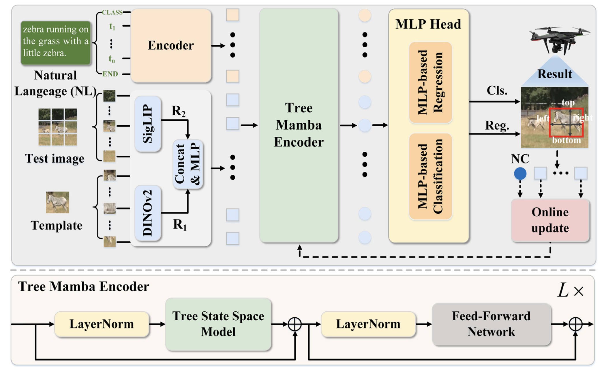
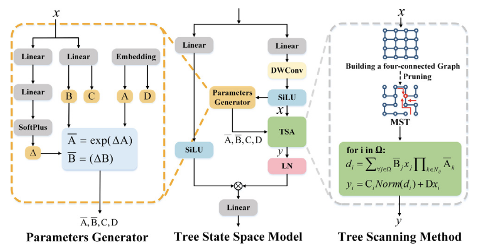
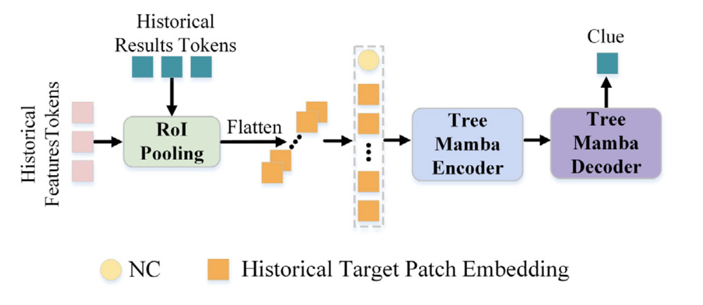
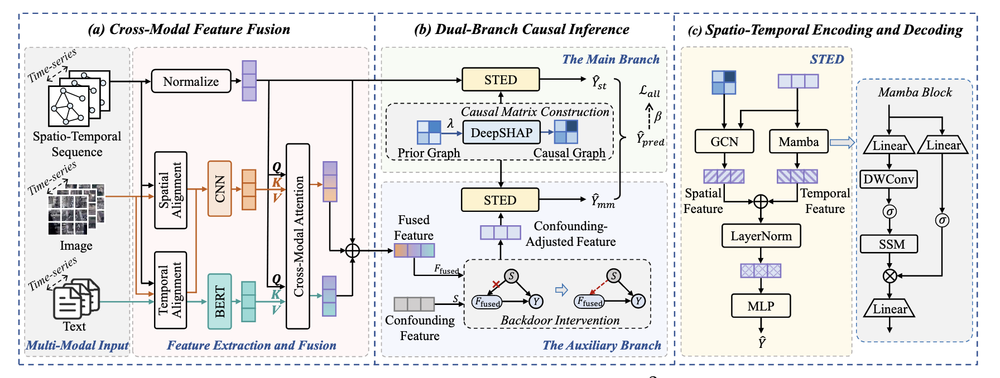
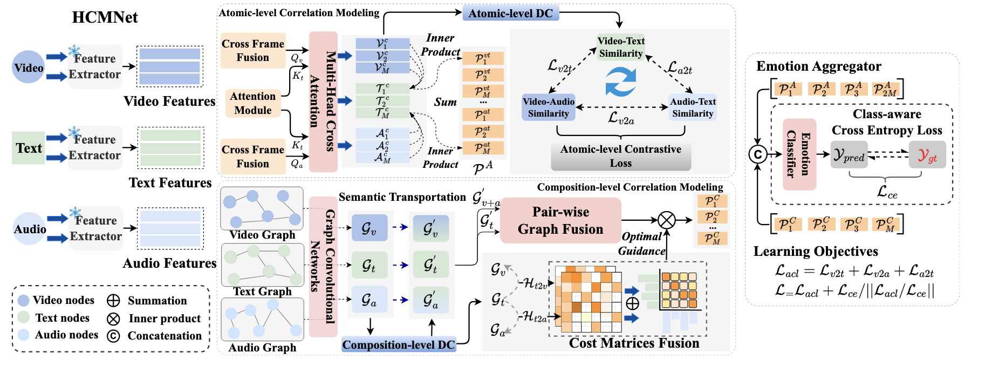

# 工作汇报

[王倓](https://github.com/Mandorian) 2026.02.09

<!--s-->

# Toward a dynamic tree-Mamba encoder for UAV tracking with vision-language

<!--v-->

<!--s-->

# Causal Spatio-Temporal Prediction: An Effective and Efficient Multi-Modal Approach

<!--v-->

<!--s-->

# Towards Multimodal Sentiment Analysis via Hierarchical Correlation Modeling with Semantic Distribution Constraints

<!--v-->
