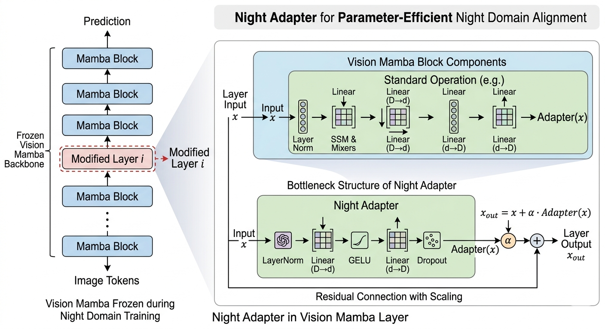
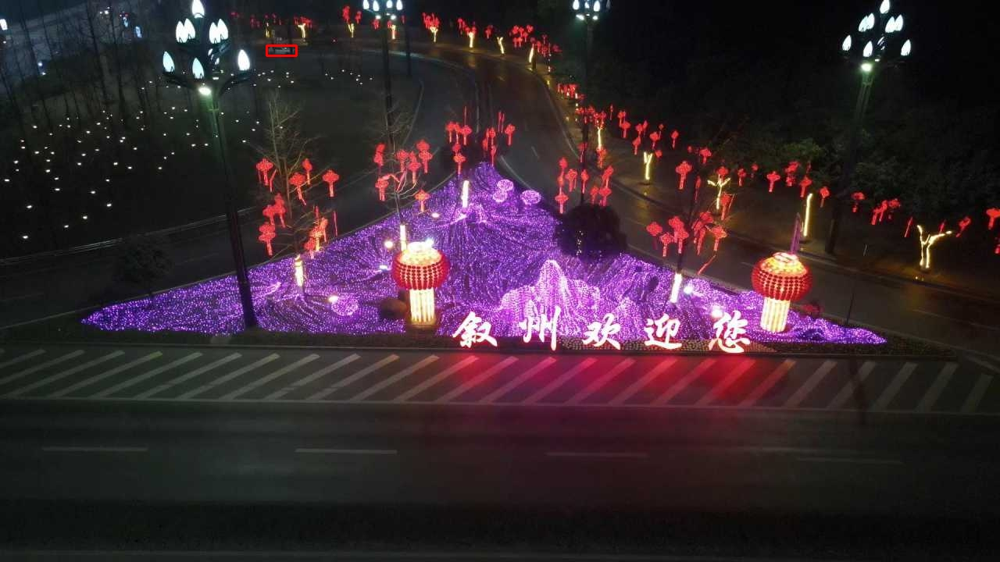
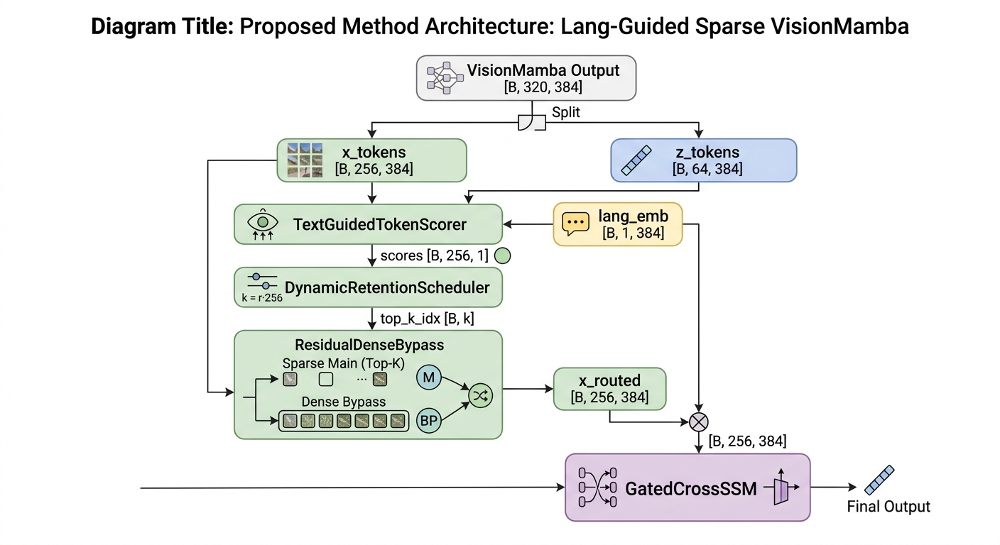
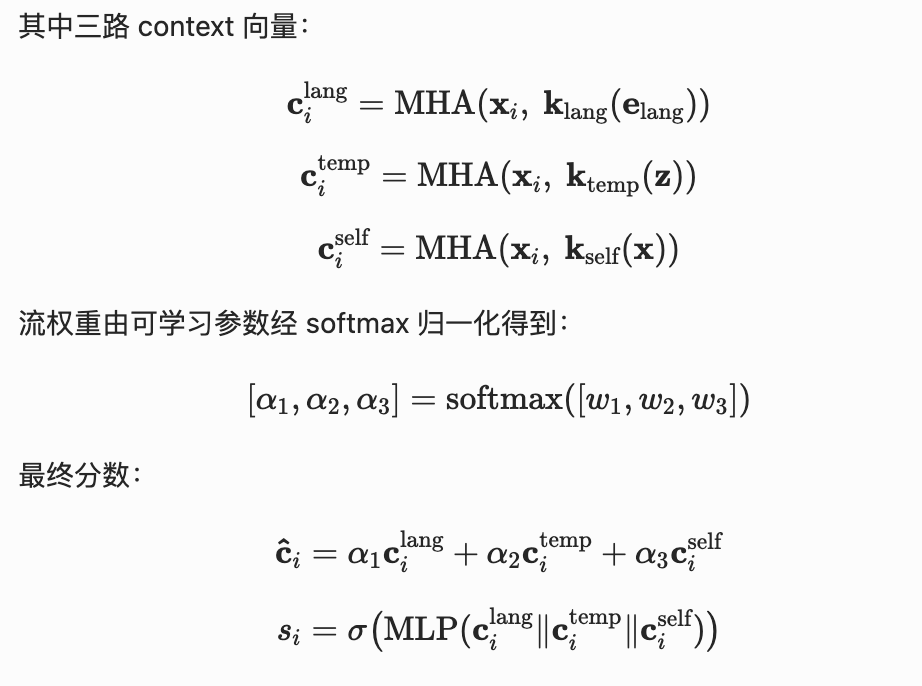

# 工作汇报

[王倓](https://github.com/Mandorian) 2026.03.23

<!--s-->

# Sampling Scheduler + ADW Loss

<!--v-->
## 动机

+ 早期训练不稳定：夜间数据更难、噪声大、样本规模小，如果开局就高比例采样，模型容易梯度震荡。
+ 后期域偏移：若一直按均匀采样，主导梯度来自白天大数据集，夜间泛化不足。
+ 跨数据集规模极不平衡。
+ 难样本学习不足。
+ 夜间域重要性不足。

通过设计动态调度器，使模型在前期重点学习白天特征，后期主要学习夜间样本特征，通过“先稳后偏”的策略，在训练前期维持可学习性，后期逐步把优化重心迁移到夜间域。通过$L_{ADW}$约束模型在后期重点学习夜间难样本。

<!--v-->
## 详细设计

每个epoch的训练循环开始前动态改写训练集采样概率，白天数据采样比例按epoch呈余弦调度
$$
r(e)=r_0 + (r_t-r_0)\cdot \frac{1-\cos(\pi\cdot \min(e/E_w,1))}{2}
$$

- $r_0$：初始夜间比例
- $r_t$：目标夜间比例
- $E_w$：预热epoch
  
自适应数据加权（ADW）损失，根据训练集的大小和IoU分配权重，从而动态地将更多精力放在具有挑战性的少数样本（即夜间数据）上。为
$$
L_{adw}=\frac{1}{B}\sum_{i=1}^{B}(w_{log}+0.5)^{(1-\hat{IoU})}\cdot(-\log \hat{IoU}) - \hat{IoU}(1-\hat{IoU})
$$
  
<!--s-->

# Gated CMM

<!--v-->
## 详细设计

跨模态融合的核心困境在于文本模态的动态不可靠性，当文本质量低下时，需建立防御机制避免噪声污染视觉特征空间。当文本语义精准时，则需主动增强其引导作用以弥补视觉表征的语义鸿沟——关键在于构建质量感知的自适应融合策略，使系统能够实时评估文本可信度并动态调节融合强度，而非依赖固定权重的静态交互模式。

1. 文本和图像经过Encoder层得到`out_v`（视觉路径）与`out_l`（文本路径）。
2. `lang_conf_proj: Linear(D->1)`预测语言置信度$c\in(0,1)$。
3. 拼接`[out_v, out_l, c]`输入门控网络，得到$\alpha\in(0,1)^D$。
4. 融合$\text{fused}=\alpha\odot out_v + (1-\alpha)\odot out_l$

<!--s-->

# Adapter Layer

<!--v-->
## 详细设计
`Vision Mamba`在训练时保持冻结，在处理夜间图像时不能充分捕捉夜间特征，通过引入`Adapter Layer`在不破坏主干结构的条件下，以参数高效方式补偿夜间域偏移。

`Night Adapter`采用`bottleneck`结构，插入`Vision Mamba`的指定层，输出
$$x_{out}=x + \alpha\cdot Adapter(x)$$
其中`Adapter(x)` 为：

- LayerNorm
- Linear(D->d)
- GELU
- Linear(d->D)
- Dropout

<!--s-->

# TASR：Text-Adaptive Sparse Routing

<!--v-->
## 动机
在夜间低光照`UAV`跟踪场景中，搜索区域（256个 patch token，对应 16×16 网格）存在严重的信噪比问题：

| 场景特征 | 影响 |
|---|---|
| 大量黑暗背景区域 | 大部分token携带近零有效信息 |
| 目标占据少量token | 小目标仅占少量token |
| 光照干扰（车灯/路灯）| 高亮非目标token干扰跨模态融合 |
| 文本描述可提供先验 | "car"、"person"等类别语义可区分目标与背景 |

通过压缩冗余输入、保留与任务相关的互信息，是提升泛化能力的核心机制。`TASR`通过文本引导的`top-k`路由实现这一目标。`TASR`包含三个字模块：
+ TextGuidedTokenScorer（文本引导打分器） 
+ DynamicRetentionScheduler（动态保留率调度器）
+ ResidualDenseBypass（残差旁路）

<!--v-->

<!--v-->
## 文本引导打分器

<!--v-->
## 动态保留率调度器
硬阈值对不同分辨率、不同目标尺寸泛化差。动态调度允许训练前期全量参与、后期稀疏，是一种从宽松到严格的课程渐进策略。
$$
r(t) = r_{\text{init}} + \frac{\min(t,\ T_{\text{warm}})}{T_{\text{warm}}} \cdot (r_{\text{min}} - r_{\text{init}})
$$

$$
k(t) = \lfloor r(t) \cdot N_x \rceil, \quad k \geq 1
$$
其中$t$为当前epoch，$T_{\text{warm}}$为warmup epochs，$N_x = 256$。

<!--v-->
## 残差旁路

打分器无法学习**哪些低分token**其实应该被保留"的信号，因为被掩码掉的token对损失函数没有贡献，梯度无法回传。稀疏路由会丢一部分token，如果没有旁路可能信息损失过大。旁路分支保留一条完整token路径，避免过度稀疏导致性能崩溃。