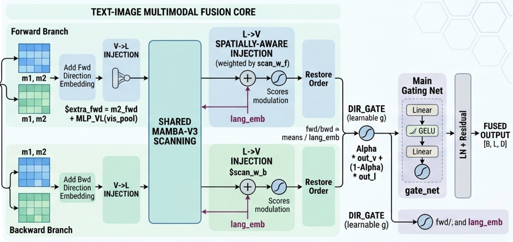
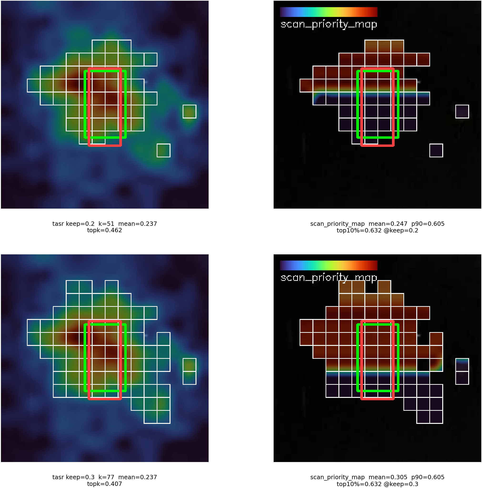
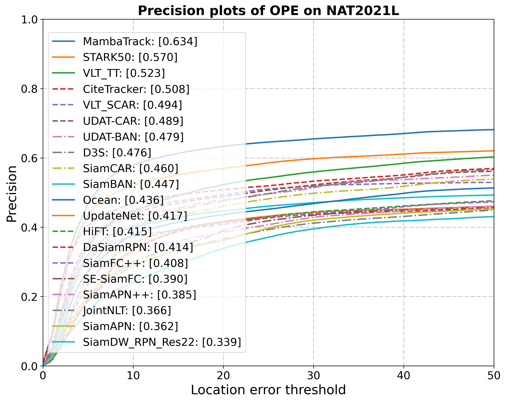
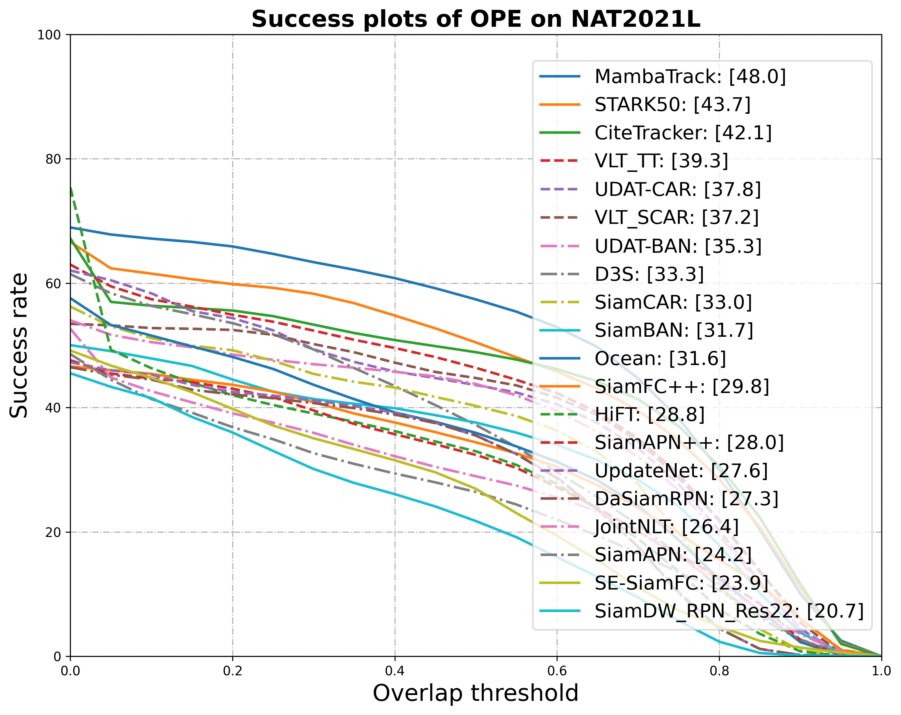
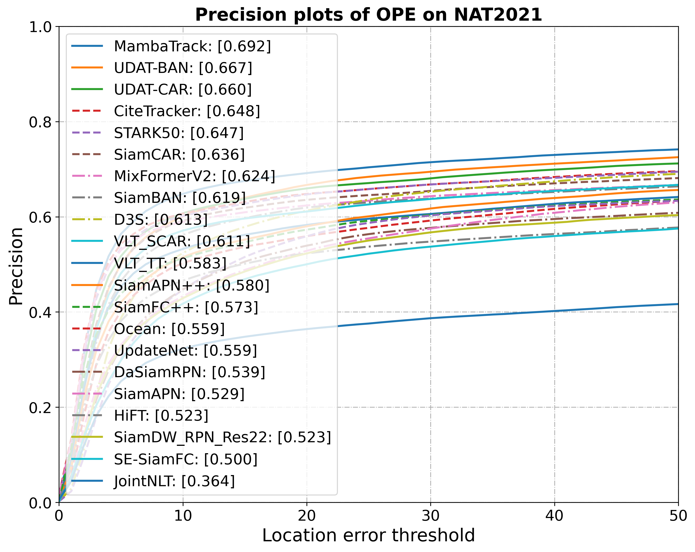
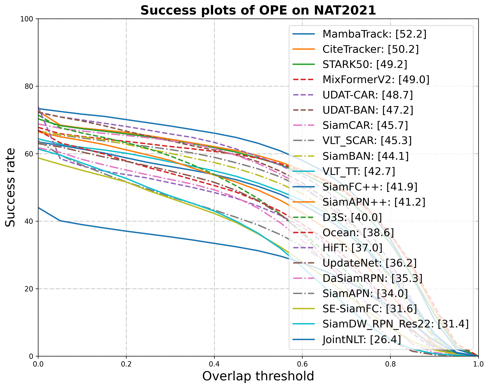

# 工作汇报

[王倓](https://github.com/Mandorian) 2026.03.07

<!--s-->

# 融合模块

<!--v-->

+ TASR分数直接作为融合排序依据，避免路由模块与融合模块评分标准不一致导致的优化目标漂移
+ 构建高分优先序sort_idx与低分优先逆序rev_idx，共享Mamba-v3双分支分别扫描，参数高效且信息互补
+ V→L注入将视觉池化特征经MLP映射叠加至语言路，L→V注入以sigmoid分数调制语言特征回传视觉路。
+ 方向门融合正向与反向扫描输出，主门控融合视觉路与语言路，层级化设计实现精细化特征融合。

<!--s-->

<!--v-->

