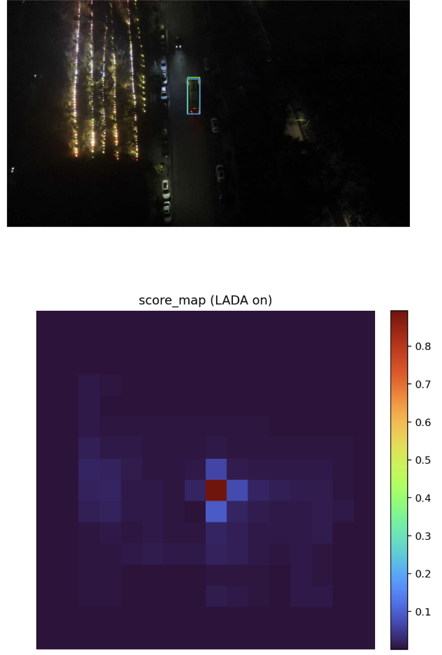
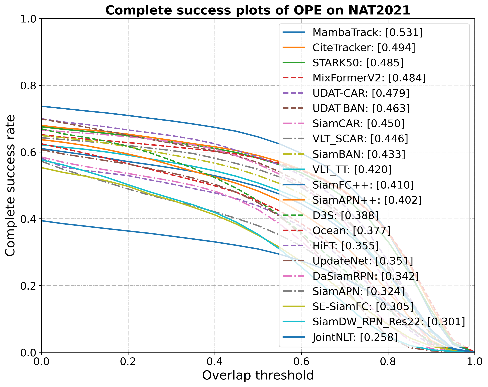
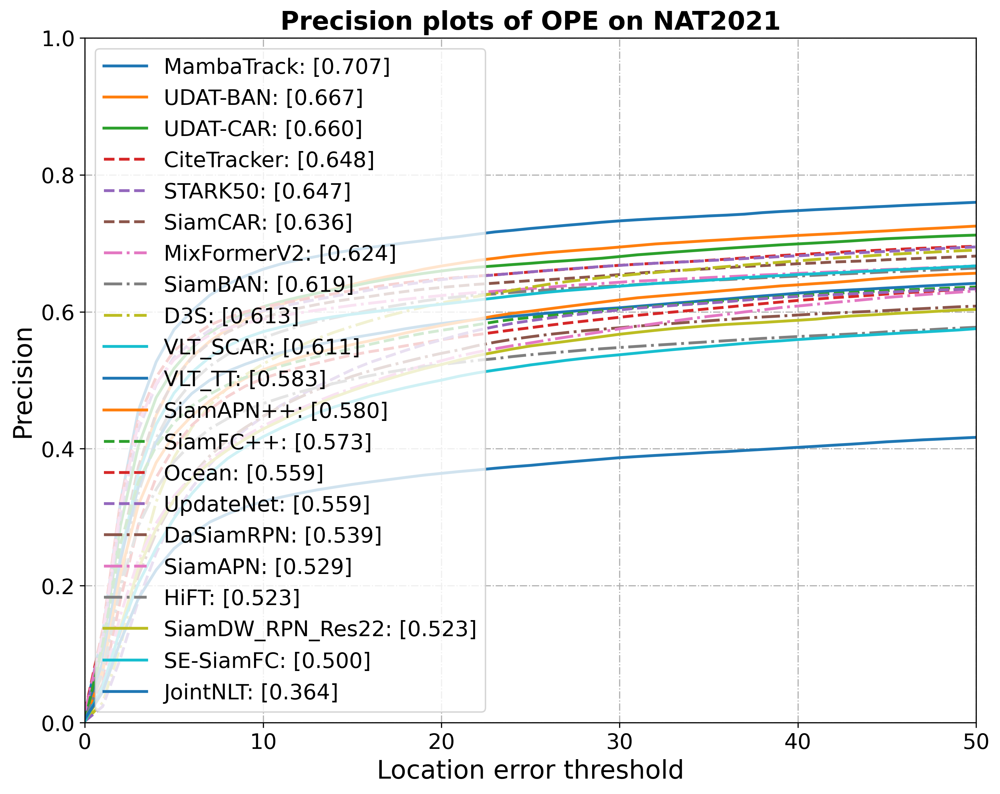
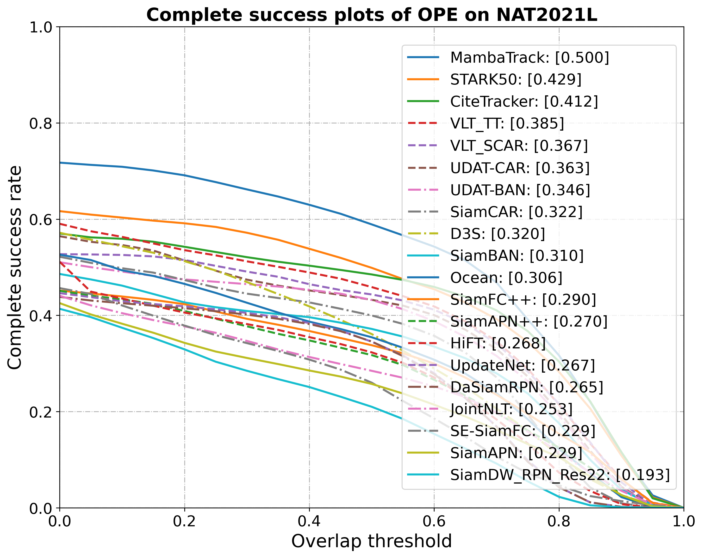
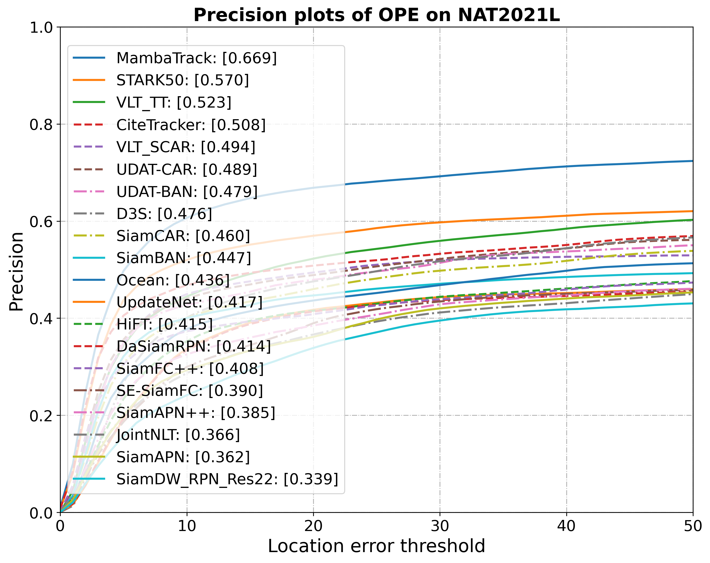

# 工作汇报

[王倓](https://github.com/Mandorian) 2026.04.14

<!--s-->

# 后处理

<!--s-->

# 动态模版更新

<!--v-->
## 动态模版更新

+ $v_{tasr}=\left|tasr_{mean}-EMA\left(tasr_{mean}\right)\right|$
+ $v_{color}=D_B(hist_{ref},hist_{cur})=\mathbf{-ln}\left(\sum \sqrt{hist_{ref}\times hist_{cur}}\right)$
+ $v_{size}=\left|\log\left(area+\epsilon\right)-\log\left(EMA\left(area\right)+\epsilon\right)\right|$
+ $v_{iou}=1-iou$
+ $v_{app}=1-sim_{app}$

$EMA$平滑处理$EMA_t = \beta\ EMA_{t-1} + (1-\beta) x_t$,实验中$\beta=0.8$。总波动分数$V = 0.20v_{tasr} + 0.20v_{app} + 0.20v_{color} + 0.20v_{size} + 0.20v_{iou}$

- 若$V \ge T\_{HIGH}=0.35$：硬更新计数+1，达到`HARD_CONFIRM_FRAMES=2`后硬更新
- 若$0.20 \le V < 0.35$：软更新
- 若$V < 0.20$：无更新
  
软更新：$z_{new}=(1-\eta)z_{old}+\eta z_{cand},\quad \eta=0.2$

<!--s-->

# 动态搜索区域

<!--v-->
## 动态搜索区域

衡量峰值是否明显高于周围噪声。越高越好，表示目标峰更突出、定位更可靠。
$$
PSR=\frac{peak-\mu_{side}}{\sigma_{side}+\epsilon}
$$

衡量响应图是否“尖锐且干净”。越高越好，表示主峰集中、背景能量低

$$
APCE=\frac{\left(peak-\min\left(R\right)\right)^2}{\mathbb{E}\left[\left(R-\min\left(R\right)\right)^2\right]+\epsilon}
$$

$$
\begin{aligned}
Q=&0.45\times PSR_n + 0.40\times APCE_n + 0.15\times(1-Var_n) \\\\
&S_{target}=S_{base}+G(1-Q), G=1.4, S_{base}=4.0
\end{aligned}
$$

<!--s-->

# 结果

<!--v-->
## 结果

