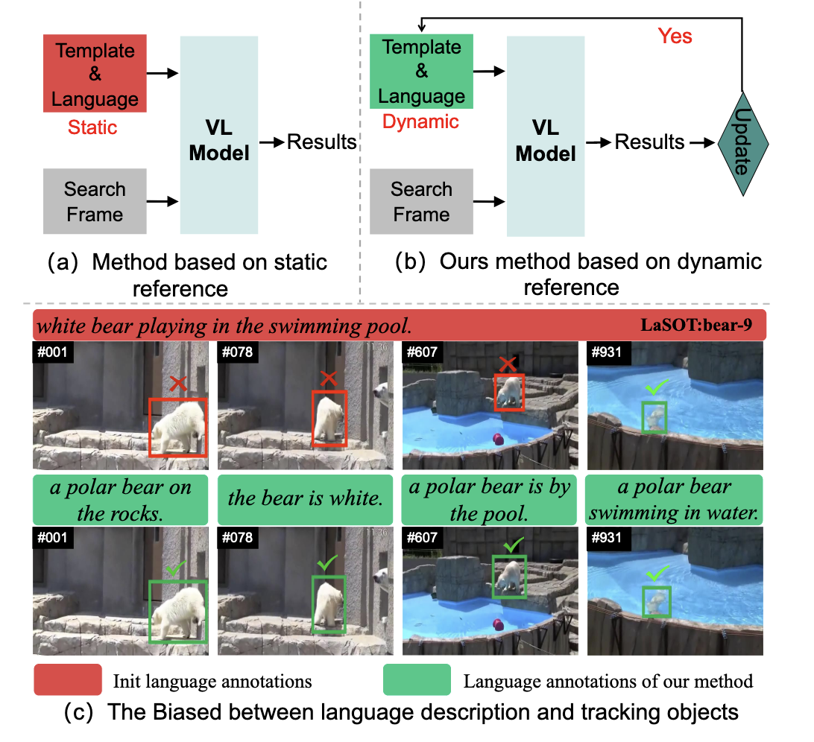
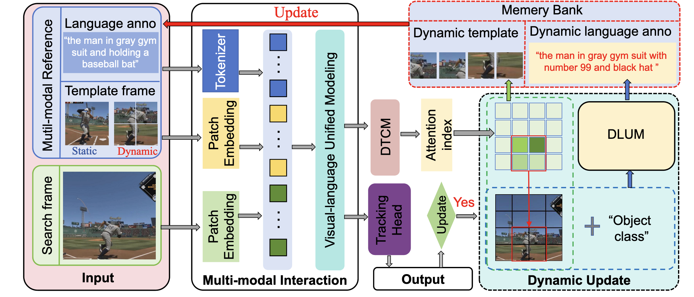
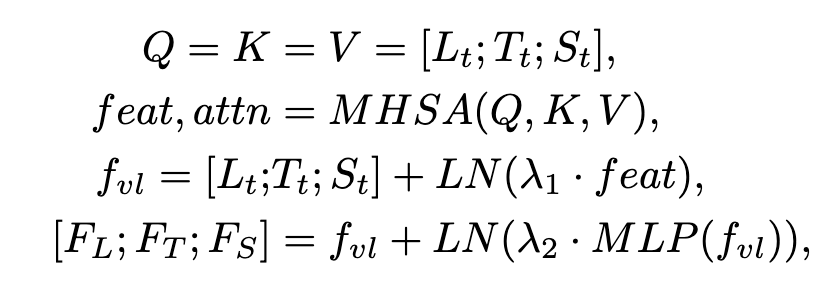
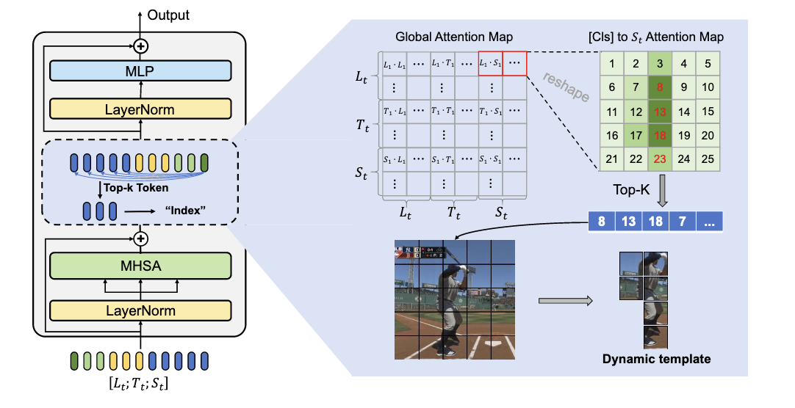
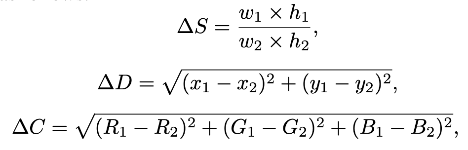
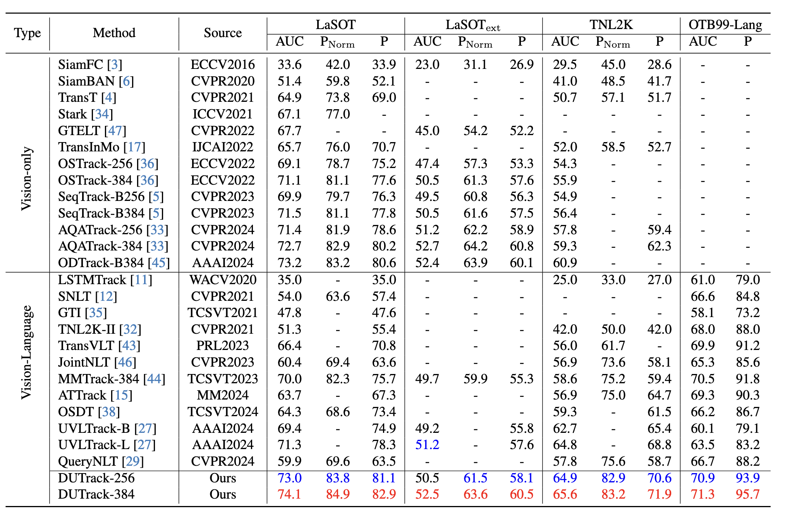

# 工作汇报

[王倓](https://github.com/Mandorian) 2026.03.17

<!--s-->

# Dynamic Updates for Language Adaptation in Visual-Language Tracking

<!--v-->
## 概述

现有视觉-语言跟踪方法依赖静态多模态引用，难以适应目标外观变化，易产生语义偏差。本文提出视觉语言跟踪框架*DUTrack*，通过动态更新多模态引用保持语义一致性。框架包含两个关键模块：
+ 动态语言更新模块：利用大型语言模型结合视觉特征与类别信息生成目标的动态描述。
+ 动态模板捕获模块：根据更新后的语言描述定位图像中匹配区域。

  

同时设计更新策略，根据目标位移与尺度变化决定是否更新描述。最终利用动态模板与语言描述持续更新参考信息，提升跟踪鲁棒性。

<!--v-->
## 架构
主要有四个组件构成：多模态交互模块、动态更新模块、动态变化捕获模块和跟踪头。
该架构以搜索图像和多模态引用为输入，首先通过图像*补丁嵌入*和文本标记化将视觉与语言信息转化为统一令牌，并在视觉-语言统一模型中进行多模态交互建模，随后利用全局注意图索引与语言描述高度匹配的区域，并将搜索特征图输入跟踪头预测目标位置，同时根据目标位置与尺度变化，将当前搜索图像及类别信息输入动态语言更新模块生成新的语言描述，最终结合动态模板与更新后的语言注释刷新多模态引用。

<!--s-->
## 多模态交互
采用*HiViT*进行统一的视觉-语言建模，将搜索图像和模板图像通过三个阶段的下采样转换为令牌表示：首先经过一个4×4的嵌入层，然后经过两个2×2的合并层，最终得到搜索令牌$S_t \in \mathbb{R}^{N_S \times D}$和模板令牌$T_t \in \mathbb{R}^{N_T \times D}$。语言注释$L$通过*BERT*的tokenizer转换为语言令牌$L_t \in \mathbb{R}^{N_L \times D}$，其中$L_t$以`[CLS]`令牌开头。$N$表示令牌数量，$D$表示特征维度$N_S = \frac{H_S W_S}{16^2},N_T = \frac{H_T W_T}{16^2},N_L = 16,D = 512$。模板令牌$T_t$不仅包含初始模板图像的图像块，还包括来自动态模板的图像块。形式上，统一视觉-语言建模过程可表示为：

<!--v-->
## 动态模版捕获模块
该模块从搜索图像中提取高响应补丁，并将其用作后续帧的动态模板。通过每对标记之间的点积相似度来衡量的。每个令牌的计算如下:
$$
    A=\text{Softmax}(\frac{\[Q_L;Q_T;Q_S\]\[K_L;K_T;K_S\]^T}{\sqrt{d}})\cdot \[V_L;V_T;V_S\]
$$
语言标注中的[CLS]标记可以全面概括语义信息
$$
    A_{l2s}=\text{Softmax}(\frac{\[Q_{CLS}\]\[K_S\]^T}{\sqrt{d}})\cdot \[V_L;V_T;V_S\]
$$
从$A_{l2s}$中选择相似度最高的top-k个patch，并记录它们的下标，在图像中定位相应的区域作为动态模板。

<!--v-->
## 动态模版捕获模块

<!--v-->
## 动态语言更新模块
利用大型语言模型在特定时间点动态生成目标的描述。这些注释包括关于对象的位置、尺度和颜色的语义信息，通过引入了一个对象戳$r_{stamp}: \[x1, y1, w1,h1\]$，它记录了上次更新后的目标信息，用目标第一帧的注释初始化。当前帧的跟踪结果也表示为$r_i:\[x2，y2，w2，h2\]$。通过比较中心点的位移，目标尺度的变化，以及rstamp和ri之间边界框内平均颜色的变化，动态地确定是否应该更新语言注释。

$\Delta S,\Delta D,\Delta C$表示当前目标相对于目标图戳的尺度、位置和颜色平均值的变化，利用大型语言模型同时学习搜索图像和对象类别之间的关系，有效地生成与对象类别相关的上下文相关描述。

<!--v-->
## 结果

