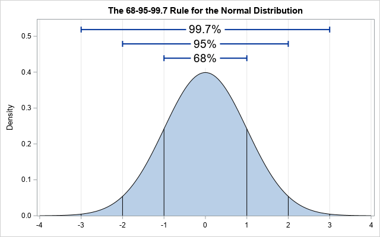
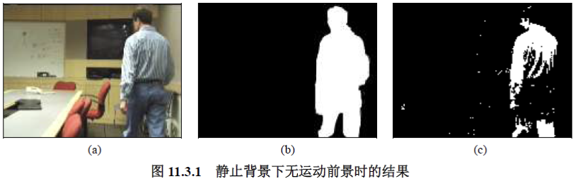
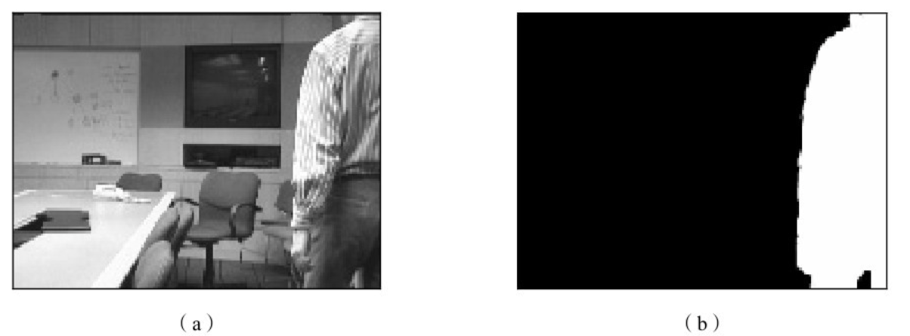
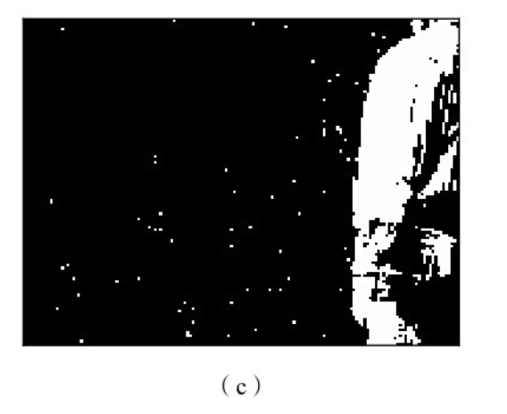
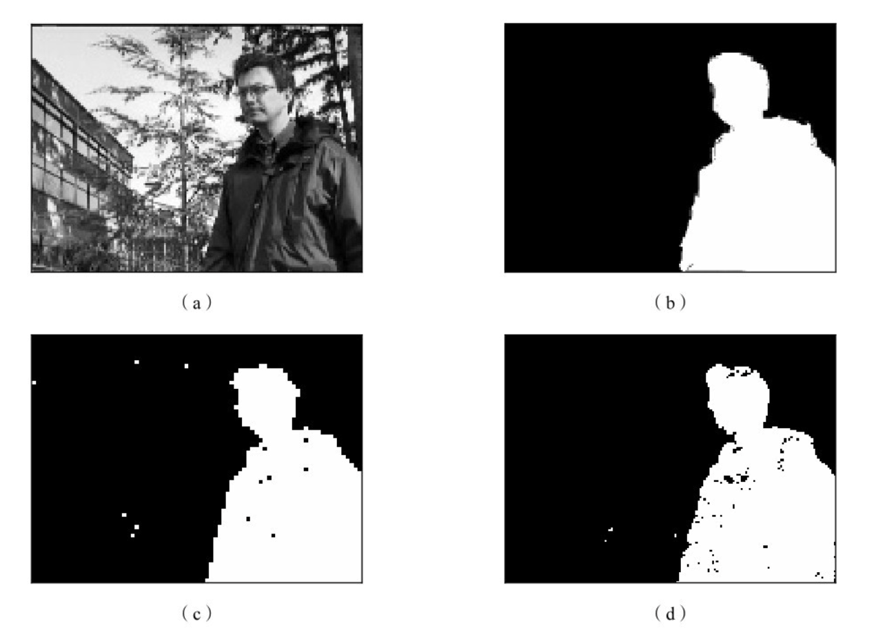
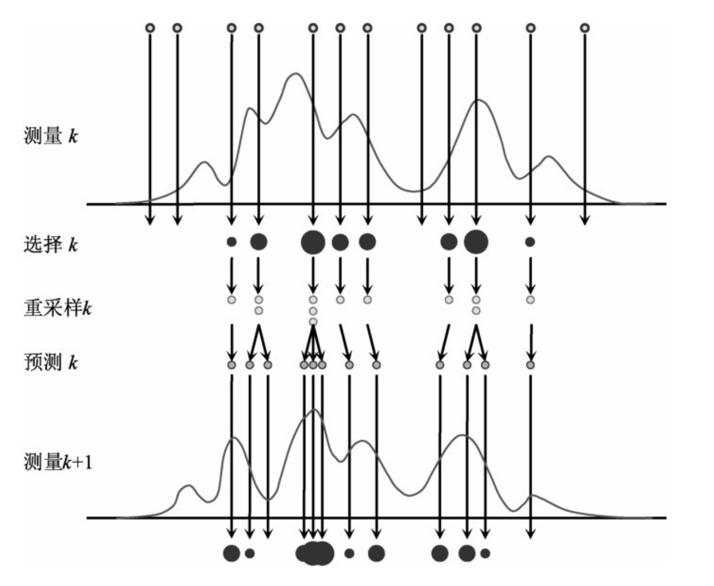
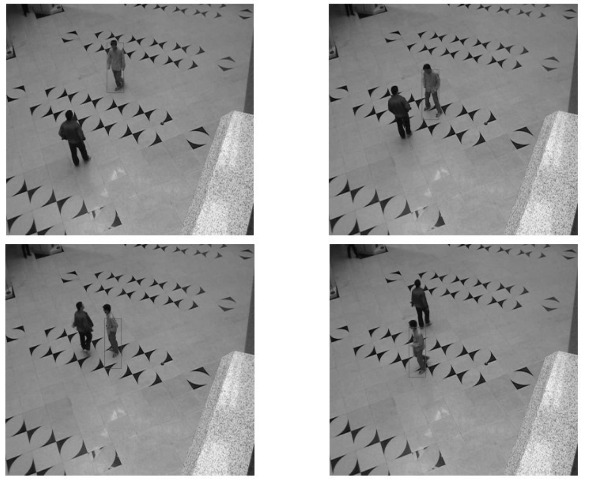
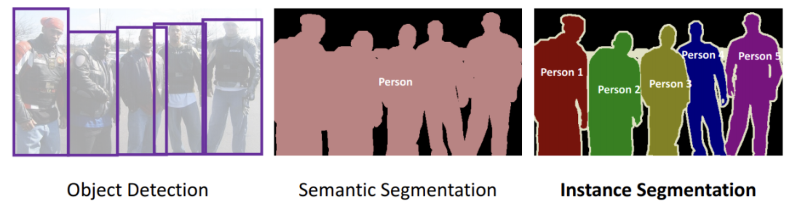

# 运动目标检测

小组成员：王倓、马靓、徐龙腾、张荣辉、Rahana Najiur

<!--v-->
## 概述

&emsp;&emsp;对场景中的运动目标进行分析，需要先从图像序列或视频中检测并跟踪这些目标，将其分离和提取出来。利用帧间的时间关联性，可以有两种实现方式：一是对每一帧都进行目标检测；二是先在某一帧中检测目标，再在后续帧中对其进行跟踪。下面将分别介绍两种策略的基本方法和运动目标分割的几种思路。

+ 背景建模
  + 概述
  + 典型实用方法
  

+ 运动目标追踪
  + 卡尔曼滤波器
  + 粒子滤波器

+ 运动目标分割
  + 先分割再计算
  + 先计算再分割
  + 同时计算和分割

<!--s-->

# 背景建模

<!--v-->
## 基本原理

&emsp;&emsp;背景建模是一种动态的运动检测方法，其核心思想是不将背景视为固定不变，而是通过训练阶段利 用视频序列初始帧构建一个能够自适应更新的背景模型（如基于前$N$帧像素中值），在测试阶段将当前帧与该动态背景模型进行差分比较，从而有效区分真实运动目标与环境噪声、光照变化等干扰因素，实现更鲁棒的运动目标检测。

&emsp;&emsp;下面将介绍几种典型的基本背景建模方法，它们都将对运动前景的提取工作分为模型训练和实际检测两步，通过训练对背景建立数学模型，而在检测中利用所建模型消除背景获得前景。

+ 基于单高斯模型
+ 基于视频初始化
+ 基于高斯混合模型
+ 基于码本

<!--v-->
## 基于单高斯模型的方法

&emsp;&emsp;该方法认为像素点的值在视频序列中服从高斯分布，针对每个固定的像素位置，计算$N$帧训练图像序列在该位置处的像素值的均值$\mu \sigma$和方差$\sigma$。在运动检测阶段，利用背景相减法计算当前帧图像中每个像素的值与背景模型对应位置像素值的差值，然后将该差值的绝对值与阈值$T$进行比较，若满足$|\mu_T - \mu|\le 3\sigma$的条件，则判定该像素属于背景。反之该像素为运动前景。  

&emsp;&emsp;模型比较简单，但对光照强度的变化比较敏感，图（a）展示了人员进入后的实际场景图像，图（b）给出了该场景对应的真实参考结果，图（c）则呈现了采用基于单高斯模型方法所得到的运动检测结果。该方法的检测率仅为0.473，而虚警率达到0.0569。

<!--v-->
## 基于视频初始化的方法

&emsp;&emsp;在训练序列中背景静止但存在运动前景的情况下，可通过对训练视频进行初始化预处理来滤除运动前景对背景建模的干扰。

&emsp;&emsp;设定最小长度阈值$T_l$，对每个像素位置长度为$N$的序列进行截取，得到像素值相对稳定且长度大于$T_l$的若干子序列，再从中选取长度较长且方差较小的序列作为背景序列，从而将静止背景与运动前景分离开来。通过该初始化过程，将**静止背景下有运动前景**的背景建模问题转化为**静止背景下无运动前景**的标准问题，之后仍可采用前述基于单高斯模型的方法进行背景建模。

  

&emsp;&emsp;图(a)是人员尚未离开时的场景图像，图(b)给出了该场景对应的真实参考结果，图(c)展示了采用基于视频初始化方法所得到的运动检测结果。

## 基于高斯混合模型的方法

&emsp;&emsp;训练序列中背景存在运动时，采用多个混合高斯分布对各像素分别建模，通过$K$个高斯分布$N(\mu_k, \sigma_{k}^2)$描述像素灰度$f(t)$随时间变化的概率

$$
P\big[f(t)\big]=\sum_{k=1}^{K} w_k(t)\frac{1}{\sqrt{2\pi}}\exp\left(-\frac{\big[f(t)-\mu_k(t)\big]^2}{\sigma_k^2(t)}\right)
$$

训练时依次读取$N$帧图像，将像素值与各高斯分布比较，若落在均值2.5倍方差范围内则匹配成功，按公式
$w_k(t)=
\begin{cases}
(1-a)w_k(t-1), & k\neq l \\\\
w_k(t-1), & k=l
\end{cases}$
更新权重，并重新归一化$w$，同时按$\mu_k(t)=(1-b)\mu_l(t-1)+bf(t)$和$\sigma_k^2(t)=(1-b)\sigma_l^2(t-1)+b\big[f(t)-μ_k(t)\big]^2$更新参数（其中$b=aP\big[f(t)|\mu_l,\sigma_l^2\big]$)。  

&emsp;&emsp;若未找到匹配且模型数小于$k$则新建模型，若已有$k$个模型均不匹配则替换权重最小者。检测时按$w_k(t)/\sigma_k(t)$排序，借助常数B（背景像素比例大于B）判定前景/背景。

<!--v-->
## 基于码本的方法

&emsp;&emsp;将每个像素用一个码本表示，码本包含一个或多个代表状态的码字。首先借助训练帧图像学习生成码本（训练内容可含运动前景或背景）。然后通过时域滤波器滤除代表运动前景的码字，保留背景码字。再通过空域滤波器恢复被误滤除的码字（代表较少出现的背景），以减少背景区域零星前景虚警。最终码本作为视频序列背景模型的压缩形式。

&emsp;&emsp;图（a）是人进入后的一个场景，图（b）给出对应的参考结果，图（c）给出用基于高斯混合模型方法得到的结果，图（d）给出用基于码本的方法得到的结果。 

<!--s-->

# 运动目标追踪

<!--v-->
## 卡尔曼滤波器

&emsp;&emsp;卡尔曼滤波器是一种自适应滤波器，专门用于处理非稳态输入。它采用状态空间描述系统，并可通过递推方法求解，非常适合实时应用。在运动目标跟踪中，卡尔曼滤波器的主要作用是预测目标在下一帧图像中的位置。  

&emsp;&emsp;设位置噪声为$e$，速度噪声为$w$，则有
$$
x_i^+ = x_{i-1}^+ + v_{i-1}^+ + e_{i-1},
v_i^+ = v_{i-1}^+ + w_{i-1}
$$

**预测方程**（观测前的最优估计）：

$$
x_i^- = x_{i-1}^+ , \quad \sigma_i^- = \sigma_{i-1}^+
$$

**校正方程**（观测后的最优估计）：

$$
x_i^+ = \frac{x_i / \sigma_i^2 + x_i^- / (\sigma_i^-)^2}{1 / \sigma_i^2 + 1 / (\sigma_i^-)^2},
\sigma_i^+ = \left[ \frac{1}{\sigma_i^2 + 1 / (\sigma_i^-)^2} \right]^{1/2}
$$

<!--v-->
## 粒子滤波器

粒子滤波器是一种递归的贝叶斯方法，在每个步骤使用一组后验概率密度函数的采样。

1. **粒子表示后验**：将后验概率密度写成粒子的加权和形式，每个粒子代表一个可能的状态（如位置），对应的权重表示该状态的可信度。所有权重之和为1。
2. **预测与更新**：根据上一时刻的粒子状态和状态转移模型，预测当前时刻的粒子（先验）。然后利用当前观测值，通过似然函数更新每个粒子的权重，得到后验分布的离散加权逼近。
3. **重要性采样**：当无法直接从后验分布采样时，引入一个容易采样的**建议密度**函数，从中抽取粒子，并通过权重更新公式来校正权重，保证逼近的正确性。
4. **重采样**：纯序列重要性采样经过几次迭代后，往往只有一个粒子的权重较大，其余权重几乎为零。为此，采用**系统化重采样**等方法：依据权重的累积分布函数，在$[0,1]$区间均匀取点，将小权重粒子剔除，对大权重粒子进行复制加倍。这样既能保留大概率状态，又维持了粒子的多样性。

&emsp;&emsp;通过上述迭代过程，粒子滤波器可以在大量粒子的条件下逼近最优贝叶斯估计，适用于卡尔曼滤波器的高斯假设不成立的复杂跟踪场景

<!--v-->
## 粒子滤波器

<!--v-->
## 粒子滤波器

<!--s-->

# 运动目标分割

<!--v-->
## 基本概念
&emsp;&emsp;在图像序列中检测并分割出运动目标，本质上可以视为一个空间分割问题。以视频图像为例，分割的目标是逐帧提取出其中独立运动的区域（即目标）。

&emsp;&emsp;为了解决这一空间分割任务，可以采用三种不同的信息利用方式：一是利用图像中的时域信息，也就是相邻帧之间灰度等特征的变化；二是利用图像中的空域信息，即单帧图像内部灰度值等特征的变化；三是同时结合时域和空域两种信息进行处理。

<!--v-->
## 主要策略

**1. 先分割之后再计算运动信息**  
&emsp;&emsp;这种方法先利用灰度、颜色等特征将视频帧分割成不同区域，再对每个运动区域用运动矢量场估计仿射运动模型参数。其优点是能较好保留区域边缘，缺点是复杂场景下容易过度分割，因为同一运动物体可能被分成多个区域。另一种层次化变体是先拟合整体变化区域的参数模型，再逐步分割成小区域，通过反向跟踪和参数可靠性验证迭代优化，直到每个区域内参数模型一致。

**2. 先计算运动信息再分割**  
&emsp;&emsp;该方法属于间接分割，先在两帧或多帧图像间估计光流场（全图运动矢量场），然后基于该场进行分割。分割依据是运动矢量差异较大的位置形成运动边界，从而使得颜色或纹理不同但运动相近的像素被划分到同一区域。这减少了过度分割的可能性，结果更符合人们对运动物体的直观理解。

**3. 同时计算运动信息和进行分割**  
&emsp;&emsp;该方法将运动估计与区域分割联合求解，通常建立在马尔可夫随机场和最大后验概率（MAP）框架下。通过统一优化目标，同时得到运动矢量场和分割结果。该方法理论上更精确，但计算量相当大。

