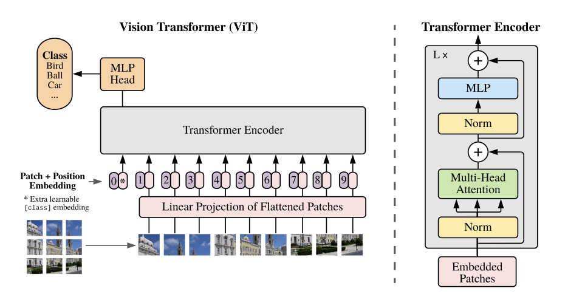
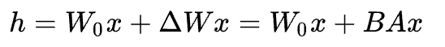
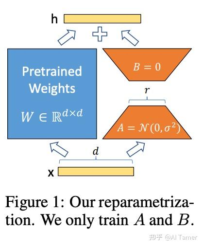

# 学习汇报

[王倓](https://github.com/Mandorian) 2025.11.23

<!--s-->

# Transformer

<!--v-->
## 架构

<!--v-->
## 自注意力机制

在计算的时候需要用到矩阵Q(查询)，K(键值)，V(值)。在实际中，Self-Attention接收的是输入。Q，K，V正是通过Self-Attention的输入进行线性变换得到的。
$$
\text{Attention}(Q, K, V) = \text{softmax}(\frac{QK^T}{\sqrt{d_k}}V)
$$

<!--v-->
## 多头注意力
当给定相同的Q、K和V的集合时，希望模型可以基于相同的注意力机制学习到不同的行为，然后将不同的行为作为知识组合起来，用于捕获序列内各种范围的依赖关系。

用独立学习得到不同的线性投影，来变换Q、K和V。将变换后的Q、K和V将并行地送到自注意力中。 最后，将输出拼接在一起，并且通过另一个全连接层以产生最终输出。  

<!--v-->
## ViT
ViT将输入图片分为多个patch，再将每个patch投影为固定长度的向量送入Transformer，后续encoder的操作和原始Transformer中完全相同。但是因为对图片分类，因此在输入序列中加入一个特殊的token，该token对应的输出即为最后的类别预测

<!--s-->

# MOE

<!--v-->
## 架构

它主要由一组专家模型和一个门控模型组成。MoE的基本理念是将输入数据根据任务类型分割成多个区域，并将每个区域的数据分配一个或多个专家模型。每个专家模型可以专注于处理输入这部分数据，从而提高模型的整体性能。

它主要包括两个核心组件：GateNet和Experts。GateNet的作用在于判定输入样本应该由哪个专家模型接管处理。而Experts则构成了一组相对独立的专家模型，每个专家负责处理特定的输入子空间。

<!--s-->

# LoRA

<!--v-->
LoRA（Low-Rank Adaptation）微调是一种用于调整大型预训练模型的高效微调技术。这种方法主要针对如何在保持模型大部分参数固定的同时，通过引入少量可训练参数来调整模型以适应特定任务。

LoRA在RGB+多模态领域是一个低成本、高灵活的微调工具，既能高效适应新模态和新任务，又能促进跨模态特征融合，同时保持预训练模型的稳定性。

