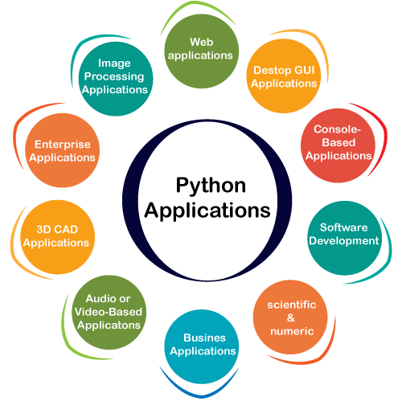

<!-- .slide: data-background="https://images.ctfassets.net/mrop88jh71hl/55rrbZfwMaURHZKAUc5oOW/9e5fe805eb03135b82e962e92169ce6d/python-programming-language.png" -->

# The Python Language 

<!--v-->
## Group division

<!--s-->
## Topic
**The main content is divided into the following parts**

+ What is Python?

+ What makes Python special?

+ Why more and more people are learning Python?

+ The current state of Python.

let's jump right in...

<!--s-->

# What is Python?

<!--v-->
## History

Python is a high-level programming language that was created by [Guido van Rossum](https://gvanrossum.github.io/) in 1991.   

It is named after the British television series **"Monty Python's Flying Circus"** that van Rossum was a fan of.   

**Python 0.9.0(February 1991)**-The first official Python release, version 0.9.0 came out. This version included exception handling, functions, and modules.

**Recent Developments(2020s)**: Python continues to evolve with regular releases. Python 3.10 was the latest stable version, but subsequent releases are expected to bring further enhancements and features.

<!--v-->
## Definition

    

Python is an **object-oriented**, open-source programming language often used for rapid application development.

Python's simple syntax amphasizes readability, reducing the costof program mantenance, while its large library of functions and calls encourages reuse and extensibility.

<!-- ## Can Do

   

 -->

<!--s-->

# What makes Python special?

<!--v-->
## Features

    

python is known for its simplicity, readability, and flexibility, and is often used for **scripting, web development** and **data science**. 

Python features **dynamic typing**, which means that variables can hold any type of data, such as **integers**, **floats**, **strings** or even other **objects**.

It also uses **indentation** to define code blocks, which makes the code clean and easy to read. 

Python has a **large standard library** that contains many common functions and modules for tasks such as **file I/O**, **network programming**and **cryptography**.

<!--s-->

# Why more and more people are learning Python? 

<!--v-->
## Reasons

    

Python is an **interpreted language**, which means that the source code is interpreted directly by the Python interpreter instead of being compiled into machine code. 

This makes Python development efficient and easy to debug, but also makes it easier for beginners to learn and use. 

Python supports **modules** and **packages** that allow programmers to organize their code into separate files and directories and reuse it easily.

<!--v-->
## Programming language ranks

    

As the chart reveals, the usage of python language remains high.

<!--s-->

# The current state of Python

<!--v-->
## Current state and Outlook

Python has become very popular in recent years, and is one of the fastest-growing programming languages. 

It is used by many large companies such as Google, Facebook, and Dropbox, and is also popular for independent developers and small teams. 

Python's ease of use and versatility make it a great choice for a wide range of applications, including web development, data science, machine learning, and artificial intelligence.

<!--s-->
<!-- .slide: data-background="./thanks.png" -->
